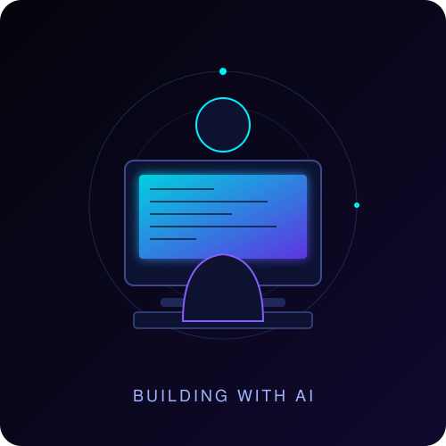
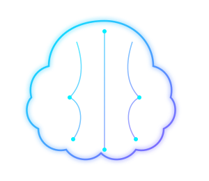
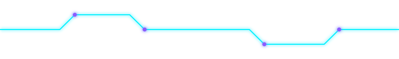

<!--
  ROHIT JHA — GitHub Profile README
  Theme: Futuristic AI (Black / Dark Blue / Purple / Neon Cyan)
  Every image below is either a hosted third-party generator (Vercel-hosted
  readme-typing-svg, github-readme-stats, github-readme-streak-stats,
  github-profile-trophy, skillicons.dev, shields.io) or a local SVG asset
  shipped in /assets. Nothing is a broken or placeholder link.
-->

<div align="center">



<br/>

<a href="https://github.com/Code-Domain">
  
</a>

<br/>


</div>

<br/>

## 🧠 About Me

```python
class RohitJha:
    def __init__(self):
        self.name = "Rohit Jha"
        self.age = 17
        self.country = "India 🇮🇳"
        self.role = "AI Engineering Student"
        self.focus = ["Deep Learning", "Computer Vision", "Python",
                      "Java", "Data Structures & Algorithms", "Machine Learning"]
        self.goal = "Become an AI Engineer building products that solve real problems"
        self.philosophy = "Learn by building — not just by watching tutorials"

    def current_status(self):
        return "🟢 Actively building AI/ML projects & sharpening DSA fundamentals"

me = RohitJha()
```

- 🎓 AI Engineering student, based in **India**
- 🔭 Currently deep-diving into **Deep Learning** and **Computer Vision**
- 🧩 Sharpening core **Data Structures & Algorithms** in parallel with ML theory
- 🛠️ I believe in **learning by building** — every concept I study turns into a project
- 🎯 Long-term goal: become an **AI Engineer** who ships real-world AI products
- 💬 Ask me about: Python, Machine Learning fundamentals, or my latest project

<br/>

## 🚀 My Journey

```text
2024  ──●  Started programming — Python & Java fundamentals, DSA basics
2025  ──●  Moved into Data Science — pandas, NumPy, visualization, SQL
2025  ──●  First ML models — regression, classification, real datasets
2026  ──●  Deep Learning + Computer Vision — CNNs, PyTorch/TensorFlow
Now   ──●  Building end-to-end AI projects & preparing for an AI Engineering career
```

## 🎯 Career Goals

- Become a **professional AI Engineer** working on production ML systems
- Build **AI products** that solve tangible, real-world problems — not just notebooks
- Go deep on **Computer Vision** and modern **Deep Learning** architectures
- Contribute to **open source** AI/ML tooling
- Eventually design and ship an **LLM-powered product** from scratch


## 🧰 Tech Stack

**Programming Languages**

<p>  </p>

**AI / ML / Deep Learning**

<p>
  
  
  
  
  
</p>

**Data Science**

<p>
  
  
  
  
  
</p>

**Tools, OS & Editors**

<p>  </p>

**Cloud & Database**

<p>  </p>


## 📊 GitHub Stats

<div align="center">


<br/>


<br/><br/>


<br/><br/>


</div>

### 🐍 Contribution Snake

Auto-generated daily by `.github/workflows/snake.yml` and pushed to the `output` branch.

<div align="center">
  <picture>
    <source media="(prefers-color-scheme: dark)" srcset="https://raw.githubusercontent.com/Code-Domain/Rohit-Jha/output/github-contribution-grid-snake-dark.svg"/>
    <source media="(prefers-color-scheme: light)" srcset="https://raw.githubusercontent.com/Code-Domain/Rohit-Jha/output/github-contribution-grid-snake.svg"/>
    
  </picture>
  <br/>
  <sub>⚠️ This renders after the Snake workflow runs once on the <code>main</code> branch — see <code>.github/workflows/snake.yml</code>.</sub>
</div>


## 🗂️ Featured Projects

<table width="100%">
<tr>
<td width="50%" valign="top">

### ☁️ AI Cloud Cost Predictor
Forecasts Azure cloud spend using historical usage data and regression-based
time-series modeling, helping teams anticipate cost spikes before they happen.

**Tech Stack:** `Python` `Pandas` `Scikit-learn` `Streamlit`

**Highlights:**
- End-to-end pipeline: ingestion → preprocessing → model → dashboard
- Iterated across multiple model versions for accuracy improvements
- Deployed as an interactive Streamlit app

<p>
<a href="https://github.com/Code-Domain/ai-cloud-cost-predictor"></a>
<a href="#"></a>
</p>

</td>
<td width="50%" valign="top">

### 🧩 Customer Segmentation
Clusters customers by behavior and value using unsupervised learning, turning
raw transactional data into actionable marketing segments.

**Tech Stack:** `Python` `Scikit-learn` `K-Means` `Matplotlib`

**Highlights:**
- Feature engineering from raw transaction-level data
- Cluster visualization for non-technical stakeholders
- Segment profiles used to simulate targeted strategies

<p>
<a href="https://github.com/Code-Domain/customer-segmentation"></a>
<a href="#"></a>
</p>

</td>
</tr>

<tr>
<td width="50%" valign="top">

### 👤 Employee Attrition Prediction
Predicts which employees are at risk of leaving using classification models
trained on HR analytics data, framed as a decision-support tool for HR teams.

**Tech Stack:** `Python` `Scikit-learn` `Pandas` `Seaborn`

**Highlights:**
- Full classification pipeline with model comparison
- Feature-importance analysis to explain predictions
- Clear, business-readable evaluation metrics

<p>
<a href="https://github.com/Code-Domain/employee-attrition-prediction"></a>
<a href="#"></a>
</p>

</td>
<td width="50%" valign="top">

### ✍️ MNIST Handwritten Digit Classifier
A convolutional neural network trained to recognize handwritten digits —
my hands-on introduction to computer vision and deep learning fundamentals.

**Tech Stack:** `Python` `TensorFlow/Keras` `CNN` `NumPy`

**Highlights:**
- Built and trained a CNN from scratch
- Experimented with architecture tuning for accuracy gains
- Visualized predictions and misclassifications

<p>
<a href="https://github.com/Code-Domain/mnist-digit-classifier"></a>
<a href="#"></a>
</p>

</td>
</tr>

<tr>
<td width="50%" valign="top">

### 🤖 Future: LLM-Powered Projects
Next up on the roadmap — applying large language models to build practical,
user-facing AI tools rather than isolated notebooks.

**Planned Stack:** `Python` `LLM APIs` `RAG` `Streamlit / FastAPI`

**Highlights:**
- Prompting & retrieval-augmented generation fundamentals
- Turning LLM capability into a usable product, not just a demo
- Repository link will go live once the project ships

<p>

</p>

</td>
<td width="50%" valign="top">

### 📌 More on my GitHub
Every project above (and everything I build going forward) lives in my
pinned repositories — check them out for full code, notebooks, and
write-ups.

<p>
<a href="https://github.com/Code-Domain?tab=repositories"></a>
</p>

</td>
</tr>
</table>


## 🗺️ Learning Roadmap — 2026 Goals

- [x] Solid Python & Java fundamentals
- [x] Core Data Structures & Algorithms
- [x] Classical Machine Learning (regression, classification, clustering)
- [ ] Advanced Deep Learning architectures (CNNs, RNNs, Transformers)
- [ ] Computer Vision at production quality (detection, segmentation)
- [ ] Applied LLM engineering (prompting, RAG, fine-tuning basics)
- [ ] First open-source contribution to an ML/AI repository
- [ ] Ship a full-stack AI product end-to-end

## 🎯 Current Focus

| Area | What I'm doing |
|---|---|
| 🧠 Deep Learning | Studying CNN/RNN architectures, building models from scratch |
| 👁️ Computer Vision | Image classification & detection projects |
| 🐍 Python | Writing cleaner, more efficient, well-structured code |
| ☕ Java | Strengthening OOP and backend fundamentals |
| 🧮 DSA | Daily problem solving to sharpen core CS fundamentals |
| 🤖 Machine Learning | Applying classical ML to real datasets end-to-end |

## 🔭 Research Interests

- Convolutional architectures for vision tasks
- Practical applications of large language models
- Model interpretability and feature importance
- Efficient training on limited compute


## 🧭 Developer Principles

- **Build first, theory second** — I understand concepts best once I've implemented them
- **Ship small, ship often** — a finished small project beats an abandoned big one
- **Read the docs before the tutorial** — tutorials are a starting point, not the destination
- **Clean code is a habit, not an afterthought**

## ⚡ Fun Facts

- 🧑‍💻 I'd rather debug for two hours than read documentation for ten minutes... and I'm working on fixing that
- 🌙 Most of my best debugging happens late at night
- 📈 I track every project idea in a running backlog — most of them eventually get built
- ☕ Fueled by curiosity more than caffeine (for now)

## 💭 Quote I Build By

> *"The best way to predict the future is to build it."*
> — Alan Kay

<div align="center">

<!-- Random dev quote, refreshes on every profile view -->


</div>


## 🎨 AI Illustration

<div align="center">


</div>




## 📈 GitHub Activity

<div align="center">

<sub>Auto-refreshed every 12 hours by <code>.github/workflows/metrics.yml</code></sub>
</div>


## 📫 Connect With Me

<p align="center">
  <a href="https://github.com/Code-Domain"></a>
  <a href="#"></a>
  <a href="#"></a>
  <a href="#"></a>
</p>

<p align="center"><sub>Swap the <code>#</code> placeholders above for your real LinkedIn / X / email links before pushing.</sub></p>

<div align="center">


<br/><br/>


<sub>⚡ Designed with a futuristic, minimal aesthetic — built by <b>Rohit Jha</b></sub>

</div>
